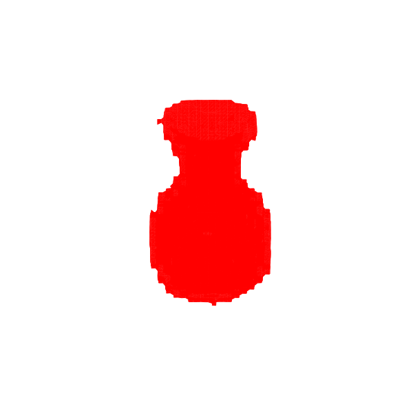
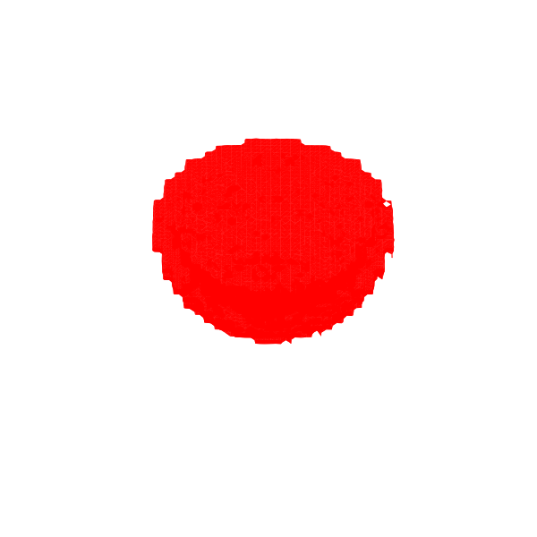

# 3D Generative Adversarial Network

3D-GAN (3D Generative Adversarial Networks) is a method that uses volumetric convolutional networks and an adversarial criterion to synthesize high-quality 3D objects.

## Installation

```console
git clone https://github.com/bareform/dependencies.git
conda update -n base -c defaults conda
conda env create -f dependencies/environment.yml
conda activate bareform

git clone https://github.com/bareform/3dgan.git
cd 3dgan
```

<details>
  <summary> Dependencies (click to expand) </summary>
  
  ## Dependencies
  - Python 3.10
  - imageio[ffmpeg]
  - matplotlib
  - numpy
  - scipy
  - scikit-image
  - torch
    
</details>

## Quick Start

To train a `vase` 3D-GAN:

```
python3 -m utils.trainer --config="./configs/shapenet_vase.toml"
```

After training for 100 epochs, you can find results similiar to gif at `./assets/shapenet/vase/vase.gif`.



To train a `bowl` 3D-GAN:

```
python3 -m utils.trainer --config="./configs/shapenet_bowl.toml"
```

After training for 100 epochs, you can find results similiar to gif at `./assets/shapenet/bowl/bowl.gif`.



To train a `bottle` 3D-GAN:

```
python3 -m utils.trainer --config="./configs/shapenet_bottle.toml"
```

After training for 100 epochs, you can find results similiar to gif at `./assets/shapenet/bottle/bottle.gif`.


You can download the pre-trained models [here](https://huggingface.co/luethan2025/3dgan) and use the provided Jupyter Notebook `inference.ipynb` to generate some videos.

## Method

[Learning a Probabilistic Latent Space of Object Shapes via 3D Generative-Adversarial Modeling](https://arxiv.org/abs/1610.07584)

Jiajun Wu<sup>1</sup>, Chengkai Zhang<sup>1</sup>, Tianfan Xue<sup>1</sup>, William T. Freeman<sup>1</sup><sup>2</sup>, Joshua B. Tenenbaum<sup>1</sup>

<sup>1</sup>MIT Computer Science & Artificial Intelligence Laboratory, <sup>2</sup>Google Research

> We study the problem of 3D object generation. We propose a novel framework, namely 3D Generative Adversarial Network (3D-GAN), which generates 3D objects from a probabilistic space by leveraging recent advances in volumetric convolutional networks and generative adversarial nets. The benefits of our model are three-fold: first, the use of an adversarial criterion, instead of traditional heuristic criteria, enables the generator to capture object structure implicitly and to synthesize high-quality 3D objects; second, the generator establishes a mapping from a low-dimensional probabilistic space to the space of 3D objects, so that we can sample objects without a reference image or CAD models, and explore the 3D object manifold; third, the adversarial discriminator provides a powerful 3D shape descriptor which, learned without supervision, has wide applications in 3D object recognition. Experiments demonstrate that our method generates high-quality 3D objects, and our unsupervisedly learned features achieve impressive performance on 3D object recognition, comparable with those of supervised learning methods. 

## Citation

The original paper can be found at:
```
@misc{wu20163dgan,
    title={Learning a Probabilistic Latent Space of Object Shapes via 3D Generative-Adversarial Modeling},
    author={Jiajun Wu and Chengkai Zhang and Tianfan Xue and William T. Freeman and Joshua B. Tenenbaum},
    year={2016},
    eprint={1610.07584},
    archivePrefix={arXiv},
    primaryClass={cs.CV}
}
```
